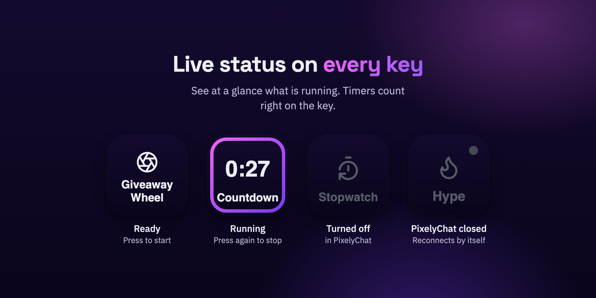
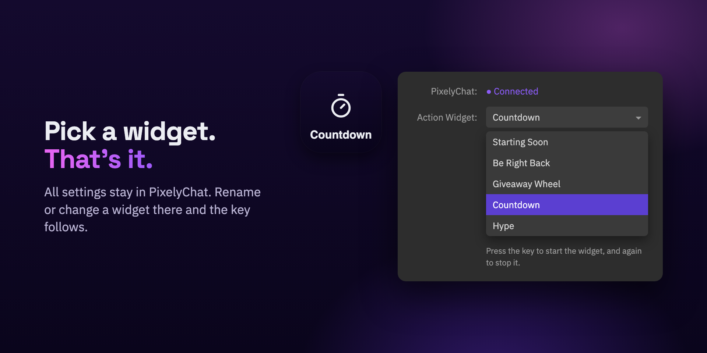
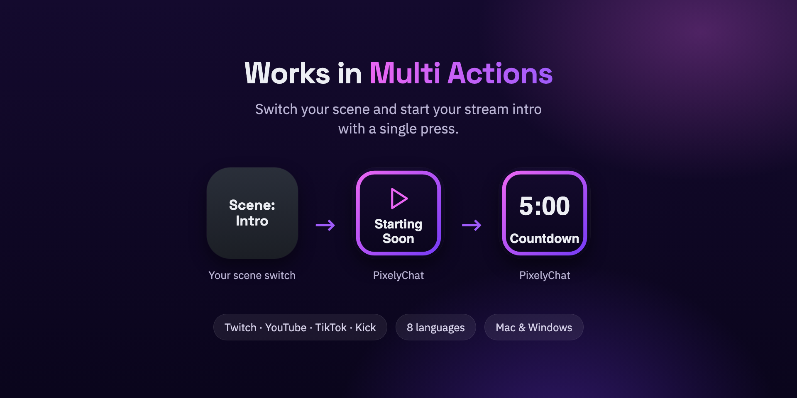

# PixelyChat for Stream Deck

Start and stop your [PixelyChat](https://pixelychat.com) Action Widgets from an
Elgato Stream Deck: Countdown, Stopwatch, Starting Soon, Be Right Back, Visual
Shoutout, Spin Wheel, Media Player and more, with one key each.



PixelyChat is a free desktop app for streamers on Twitch, YouTube, Kick and
TikTok: one chat for all platforms, alerts, overlays, widgets, rewards, a chat
bot and more. No ads, no subscription.

## What the plugin does

- **One key per Action Widget.** Press to start it, press again to stop it.
- **Live status on every key.** Keys show what's running, with the remaining
  time of countdowns and the time of stopwatches.
- **Settings stay in PixelyChat.** A key only stores which widget it controls, so
  changing a widget in PixelyChat never breaks your keys.
- **Works in Multi Actions.** Switch your scene and start your intro with a
  single press.
- **Works locally.** The plugin only talks to PixelyChat on your own computer.
  No account, no internet connection, no data sent anywhere.
- 8 languages: English, German, Spanish, French, Japanese, Korean and Chinese
  (Simplified and Traditional).

<p>
  
  
</p>

## Get started

1. Install [PixelyChat](https://pixelychat.com) and the PixelyChat plugin from the
   Elgato Marketplace.<!-- Link the Marketplace listing here once it is approved. -->
2. In PixelyChat, open **Setup → Integrations → Stream Deck** and turn on
   **Enable Stream Deck**.
3. In the Stream Deck app, drag **PixelyChat → Trigger Action Widget** onto a key
   and choose the widget.

Needs Stream Deck 7.1 or newer on Windows 10+ or macOS 12+, and PixelyChat
running on the same computer. More in the
[PixelyChat manual](https://pixelychat.com/manual/#integrations).

Found a bug or have an idea? [Open an issue](https://github.com/pixieontv/pixelychat-streamdeck/issues)
or join the [PixelyChat Discord](https://discord.gg/NjC9cUgdfQ).

---

## For developers

The rest of this page is about building and changing the plugin.

### How it talks to PixelyChat

One shared Socket.IO connection to PixelyChat's local server
(`127.0.0.1:4200`, query `dock=streamdeck`). The contract lives in
[`src/protocol.ts`](src/protocol.ts) and mirrors `src/main/local-server.ts` in
pixelychat-app:

- `streamdeck-state` (app → plugin): `{ protocolVersion, widgets: [{ id, name, type, enabled, active }] }`
- `streamdeck:toggle` (plugin → app, acked): `{ widgetId }` → `{ ok, errorCode? }`. Same as the
  widget's global hotkey: start it, or stop it while running.
- Connection error `streamdeck-disabled`: Stream Deck is switched off in PixelyChat
  (Setup → Integrations). The plugin shows "turned off" and checks again every 15 s.

The app only adds fields. A trigger is never retried or sent after a reconnect.

### Development

Enable Stream Deck's developer mode once (`npx streamdeck dev`). Without it,
`streamdeck restart` (and so `npm run watch`) reports success but keeps the old
plugin process running.

```bash
npm install
npm run build        # bundle to com.pixelychat.streamdeck.sdPlugin/bin
npx streamdeck link com.pixelychat.streamdeck.sdPlugin   # once: load into the Stream Deck app
npm run watch        # rebuild + restart the plugin on change
npm run validate     # Elgato validator
npm run pack         # dist/com.pixelychat.streamdeck.streamDeckPlugin
node scripts/fake-stream-deck.mjs   # test without hardware (PixelyChat must be running)
```

`scripts/fake-stream-deck.mjs` plays the Stream Deck app: it launches the built
plugin, places keys, presses them (this really starts/stops a widget in
PixelyChat) and checks titles, images, alerts and the settings panel data.

Plugin logs: `com.pixelychat.streamdeck.sdPlugin/logs/`. If the plugin dies before it
logs anything, check Stream Deck's own log (`~/Library/Logs/ElgatoStreamDeck/StreamDeck.log`).

Leave `Nodejs.Debug` out of the manifest for releases (no debugger by default).
`"Debug": "disabled"` passes `streamdeck validate` but makes Node exit on launch.
Use `"Debug": "enabled"` only locally when attaching a debugger.

## License

[MIT](LICENSE). Icons from [Lucide](https://lucide.dev), see
[THIRD_PARTY_NOTICES.txt](com.pixelychat.streamdeck.sdPlugin/THIRD_PARTY_NOTICES.txt).
